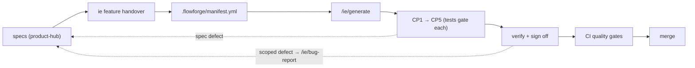

# Intent Engineering SDLC — Code Repo Workflow

> Generation guide for this code repository. The always-loaded context is [`../CLAUDE.md`](../CLAUDE.md). Specs live upstream in the product-hub; code here is generated from them. Per-command detail: [`generate.md`](../.claude/commands/ie/generate.md) and [`bug-report.md`](../.claude/commands/ie/bug-report.md).

## How code gets here

## The generation loop (`/ie/generate`, ADR-0004 · ADR-0050)

| Checkpoint | Produces |
|-----------|----------|
| **CP1 Domain Model & Contracts** | Data models, schemas, event/API/message contracts, repo interfaces |
| **CP2 Domain Logic & Rules** | Domain services, validation, business logic, state machines |
| **CP3 Interface Layer** | API endpoints, event handlers, middleware |
| **CP4 Presentation** *(optional)* | UI components, pages, design-token application |
| **CP5 Deployment Topology** | IaC, CI/CD config, deployment manifests |

Tests gate every checkpoint — don't skip ahead. Generation appends judgment calls to `.flowforge/trace.yml`.

## Before you can generate (foundation gates, ADR-0043)

`/ie/generate` hard-blocks until the required gates pass for every touched service:

`repo_exists` · `flowforge_initialized` · `workspace_registered` · `ci_configured`

Check from the product-hub: `ie service status <id>`. Attest CI (also from the product-hub) with `ie service init <id> --path <checkout> --ci-configured`.

## Pointers

- **What to build this run** → `.flowforge/manifest.yml` (assembled + sliced per repo by the hub, ADR-0041)
- **Where the product-hub lives** → `.ie/hub.yml` (per-machine pointer written by `ie feature handover`; gitignored, never committed — ADR-0038/0054). Resolve + validate it with **`ie hub path`** (the deterministic primitive `/ie/generate` uses to anchor the manifest's relative spec/standard paths). Missing or stale? Re-run `ie feature handover` from your product-hub checkout.
- **Generate** → `/ie/generate` ([detail](../.claude/commands/ie/generate.md)) in Claude Code. In **GitHub Copilot CLI** the same step is `copilot --agent ie-generate` (or pick `ie-generate` from `/agent`) — one verb, native gesture per runtime (ADR-0070). The hub enables runtimes; this repo receives the matching agent files via `ie service init` / `ie update --code-repos`.
- **Fix defects upstream** — patch the spec in the product-hub and regenerate; never hand-patch generated code (ADR-0002 · ADR-0017). For a defect in the feature currently in flight, before finalize, run `/ie/bug-report` from this repo ([detail](../.claude/commands/ie/bug-report.md)) instead of a full re-shape — it diagnoses, classifies, patches the spec, and regenerates from only the invalidated checkpoint (ADR-0079).

## Staying current (ADR-0055)

The IE-managed files in this repo — `.github/workflows/quality-gates.yml`, `docs/WORKFLOW.md`, `.claude/commands/ie/generate.md`, `.claude/commands/ie/bug-report.md` — are refreshed from the operator's product-hub with `ie update --code-repos`. It overwrites only files you have **not** edited; a locally-edited file is held and reported (re-run with `--force` to take the scaffold version). Changes arrive in your working tree — review and commit them like any change. Your `CLAUDE.md` is yours and is never touched.

## CI configuration

The `quality-gates.yml` workflow reads a few repo/org settings. Most have safe fallbacks — this table marks what you actually need.

| Setting | Kind | Needed when | Purpose |
|---|---|---|---|
| `PRODUCT_HUB_TOKEN` | Secret | Hub is a private repo (the normal case) | Lets CI **read the product-hub** (spec-drift, Gherkin coverage, standards scan) and **dispatch `ci-passed`** back to it. Classic PAT with `repo` scope that can reach the hub. The `GITHUB_TOKEN` fallback can't read a *different* repo, and the `ci-passed` dispatch has no fallback — so a private hub needs this. |
| `IE_CLI_PACKAGES_TOKEN` | Secret | Hub lives in a different org than `rp-flow` | Installs `@rp-flow/ie-cli` (used by spec-drift). Classic PAT with `read:packages` on `rp-flow` (fine-grained PATs don't support Packages; use a bot account to limit blast radius). Same-org falls back to `GITHUB_TOKEN`. Missing it only downgrades spec-drift to a skip. |
| `PRODUCT_HUB_REPO` | Variable | **Legacy manifests only** (no `product_hub_remote`) **and** the hub isn't at `{owner}/product-hub` | Names the hub as `owner/name`. Manifests from `ie feature handover` (ADR-0054) carry `product_hub_remote` and this variable is ignored. Regenerate the handover to retire it. |
| `SPEC_DRIFT_BLOCKING` | Variable | You want drift to fail the build | Default is warn-only; set `true` to fail the job on spec drift. |

**Where to set them.** A cross-org hub (a hub in a different org than this repo) needs `PRODUCT_HUB_TOKEN` and `IE_CLI_PACKAGES_TOKEN` as **organization** Actions secrets (Settings → Secrets and variables → Actions → New organization secret, scoped to all repos) so every service inherits them. A same-org *private* hub still needs `PRODUCT_HUB_TOKEN`.

**Container scanning** fails the Security Gates stage on any HIGH/CRITICAL CVE in the built image (Trivy, `--exit-code 1`) and currently has no opt-out — keep base images and dependencies patched.

## Spec-drift detection (CI, ADR-0054)

CI recomputes each manifest spec's hash from the product-hub and compares it to the pinned `spec_hash`. If the hub specs moved since handover, the PR is annotated per drifted spec (warn-only by default; set the `SPEC_DRIFT_BLOCKING` repo/org variable to `true` to fail the job). Remedy: `ie feature handover --refresh` from the product-hub. Run it yourself any time with `ie manifest verify` — from a handed-over repo it resolves the hub from `.ie/hub.yml`; pass `--hub <path-to-product-hub>` to override (CI always does).
